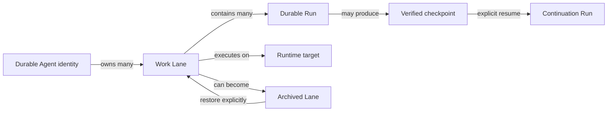

# GrokPtah Agent–Lane–Run runtime model

Status: Phase 2 design proposal  
Date: 2026-08-17  
Source: current bridge/service implementation plus the Phase 1 UX audit for issue #308

This document defines the product model that should guide the next UI and
runtime changes. It is intentionally a design contract, not an implementation
patch. Existing records and protocol fields remain authoritative until a
migration plan is approved.

## The central distinction

GrokPtah should treat these as different objects:

- **Agent** — a durable identity that persists across work. It has a role,
  policy, memory/checkpoint lineage, default model, and lifecycle. It may own
  many Lanes over time.
- **Lane** — a focused work context. It has an objective, workspace, branch or
  worktree, transcript, queue, current run, approvals, changes, tests,
  blockers, and result. It is expected to be archived frequently.
- **Run** — one execution within a Lane. It records progress, tool activity,
  changes, test observations, approval/promotion state, interruption, and
  continuation lineage.
- **Runtime target** — where a Lane or Run executes: the local desktop bridge,
  a local service/VM, or a hosted service.

The relationship is:



## Current implementation facts

The proposal is grounded in what already exists:

| Existing surface | What it already provides | Design implication |
|---|---|---|
| `SessionSummary` | Stable ID, title, cwd, kind, tags/folder, archive state, execution mode, workspace status, optional `agent_id` | A Build session can be the first backing record for a Lane; do not throw away transcript/session compatibility |
| `AgentRecord` | Explicit `agent_id`, one `session_id`, workspace, model, operational state, current run, latest checkpoint | Durable identity exists, but the one-session binding prevents one Agent → many Lanes |
| `RunRecord` | `session_id`, optional `agent_id`, queue position, parent/retry lineage, progress, execution metadata, approvals, terminal evidence | Run is already close to the desired durable execution object |
| `ContinuationCheckpoint` | Agent/run/session/workspace binding, bounded redacted context, hash, ordinal, reason | Checkpoints should belong to Agent continuity while remaining attributable to the Lane/Run that produced them |
| `grokptah-service` | Authenticated remote service, allowlisted workspaces, durable ledger, reconnect/cursor recovery, explicit resume | Local and hosted targets can share one product-level runtime abstraction |
| Desktop remote path | Remote service connection, remote session discovery/creation, `Run on` target selection | Runtime target should be visible in Lane identity and status, not hidden in the Agents tool panel |
| Persistent Agent panel | Refresh, inspect checkpoint, explicit resume, remote connect/session creation | The UI needs to become an Agent roster/detail area, not only a diagnostic panel |

### Important compatibility decision

For the first migration, `session_id` can remain the backing transcript/lane ID.
The product should introduce a Lane projection over the existing session record
before attempting to rename or delete the session concept internally. That lets
the UI and service gain the correct Agent/Lane vocabulary without breaking
transcripts, existing MCP scope, or old durable records.

## Proposed domain objects

These are conceptual shapes. They are not yet Rust or TypeScript types.

### Agent

```text
Agent {
  agent_id: stable identity
  display_name: user-facing name
  role: short role/persona description
  policy_ref: effective permission/policy profile
  memory_ref: durable memory identity or scope
  default_model: model selection
  lifecycle: active | paused | retired
  health: ready | running | waiting | interrupted | failed | needs_attention
  latest_checkpoint_id: optional verified checkpoint
  current_lane_id: optional convenience pointer
  lane_count: active + archived counts
  runtime_summary: local/hosted connection summary
  created_at / updated_at
}
```

`health` is operational and must not be confused with `lifecycle`. An Agent
can be `active` but temporarily `interrupted`; a `retired` Agent should not
start new work even if its last run was healthy.

### Lane

```text
Lane {
  lane_id: stable lane identity (initially backed by session_id)
  agent_id: optional durable owner
  title: short user-facing title
  objective: bounded current objective
  transcript_session_id: existing session backing record
  workspace: local path or service-side workspace reference
  workspace_status: ready | missing | inaccessible | not_directory
  branch_or_worktree: optional source/worktree identity
  runtime_target: local_desktop | local_service | hosted_service
  runtime_connection: connected | disconnected | stale | unknown
  status: draft | ready | running | awaiting_approval | blocked |
          interrupted | completed | failed | archived
  current_run_id: optional active run
  last_run_id: optional terminal run
  queue_summary: queued count + next position
  changes_summary: changed files and promotion readiness
  tests_summary: observed status and last command
  approval_summary: pending/approved/denied/expired
  tags / folder
  archived_at: optional timestamp
  created_at / updated_at
}
```

A Lane may be created without an Agent for ad-hoc work. Assigning a durable
Agent later should be explicit and should not rewrite the Lane’s historical
transcript or Runs.

### Run

The existing `RunRecord` is the primary source. The product projection should
add or derive `lane_id` from the existing `session_id` during the compatibility
period and expose:

```text
Run {
  run_id
  lane_id
  agent_id: optional
  state: queued | running | completed | failed | cancelled |
         interrupted | limit_reached
  origin: desktop | mcp | other
  parent_run_id: normal continuation lineage
  retry_of: explicit replacement of an interrupted run
  progress / tool summary
  execution_mode: shared | isolated_worktree
  changes / tests / final evidence
  approval / promotion state
  created_at / updated_at
}
```

The UI should never infer “the current work” from whichever tab is focused.
Every Run, approval, terminal, diff, and task event must carry an explicit Lane
scope, with the Agent shown as its owner when one exists.

### Runtime target

```text
RuntimeTarget {
  target_id
  kind: local_desktop | local_service | hosted_service
  display_name
  connection: connected | connecting | disconnected | stale | error
  workspace_authority: desktop | service_allowlist
  supports: queues, steering, terminals, computer_use, approvals, promotion
  sync_policy: local_only | metadata | transcript_and_checkpoints | explicit
  last_seen_at
}
```

This is a product-facing projection over the existing local bridge and
authenticated service connection. It does not imply that secrets, source
files, or full transcripts are automatically synchronized.

## Lifecycle semantics

### Agent lifecycle

```text
active  -> paused -> active
active  -> retired
paused  -> retired
```

- `active`: may be assigned new Lanes and resumed when its operational health
  permits.
- `paused`: remains durable and visible, but new work requires an explicit
  unpause; existing historical Lanes remain readable.
- `retired`: cannot start new Lanes or Runs. Its memory, checkpoints, Runs, and
  historical Lanes remain inspectable unless separately deleted by a future
  data-retention policy.

Operational health is displayed separately: Ready, Running, Waiting,
Interrupted, Failed, or Needs attention.

### Lane lifecycle

```text
draft -> ready -> running -> completed
                    |          |
                    v          v
               interrupted   archived
                    |          |
                    v          v
                 ready <---- restored

ready/running -> blocked -> ready
ready/running -> failed -> ready
ready/running -> awaiting_approval -> ready/completed
```

The diagram is a product simplification. A Run carries the detailed execution
state; the Lane carries the user-facing current state and next action.

### Archive semantics

Archiving a Lane:

- removes it from the default Active list;
- retains its transcript/session record;
- retains every Run, event range, checkpoint, diff, test observation, approval,
  and handoff artifact;
- retains its Agent relationship and historical ownership;
- prevents new work by default while archived;
- offers an explicit Restore action before Resume or a new Run;
- does not retire or mutate the Agent;
- does not delete files from a workspace or remove a managed worktree unless a
  separate, explicit discard/delete action is chosen.

Retiring an Agent is a different action. It affects future assignment and
resume policy, not Lane archive state.

## User-facing state matrix

Every state should have one primary message, one next action, and optional
technical detail.

| State | Primary message | Primary action | Technical detail |
|---|---|---|---|
| Empty Agents | No durable Agents yet | Create Agent or start an ad-hoc Lane | Never show this when loading failed |
| Empty Lanes | No active Lanes | Start Lane / browse Archive | Show archived count if available |
| Loading | Loading Agents/Lanes | None; show progress | Retry only after a bounded failure |
| Refresh failed | Couldn’t refresh durable work | Retry refresh | Store owner, path, OS code, and diagnostics behind details |
| Workspace missing | This Lane’s workspace is unavailable | Choose/repair workspace | Preserve Lane and transcript |
| Disconnected runtime | Runtime is disconnected; live controls paused | Reconnect or switch target | Show last-seen time and whether local fallback exists |
| Running | Agent is working in this Lane | View progress / steer / cancel | Show explicit Agent, Lane, Run, and target |
| Awaiting approval | Review required before applying changes | Review diff / approve / deny | Bind approval to Run and fingerprints |
| Interrupted | Work stopped; checkpoint available | Inspect checkpoint / Resume / Retry | State whether resume is safe and what will be new |
| Archived | Lane is archived; history is preserved | Restore / inspect | Never imply deletion |
| Retired Agent | Agent is retired; historical work preserved | Inspect / unretire if allowed | New work must be blocked clearly |
| Unknown/stale | Last known state is from a previous connection | Refresh / reconnect | Do not present stale data as current |

## Context ownership rule

The following context header should be persistent on every contextual surface:

```text
Lane: <lane title>                         [Ready / Running / …]
Agent: <agent name or Ad hoc>              [Active / …]
Runtime: <Local desktop / Hosted service>  [Connected / …]
Workspace: <safe display name>             [Ready / Missing / …]
Run: <run id or No active run>             [View progress]
```

Tools, Git, terminal, approvals, queue, steering, diffs, tests, Computer Run,
and MCP must all render this same scope. If the user opens a second Lane beside
the first, each zone needs its own header and the Tools panel must either be
explicitly attached to one Lane or become a Lane-scoped drawer.

## Local, local-service, and hosted operation

The user should be able to choose the Runtime target from the Lane, not only
from a hidden Agent panel.

| Target | Agent identity | Workspace authority | Reconnect expectation |
|---|---|---|---|
| Local desktop | Stored locally | Desktop path | Reopen local bridge; no cloud sync implied |
| Local service/VM | Service-owned | Service allowlist | Reconnect to local network endpoint; durable ledger remains on VM |
| Hosted service | Service-owned | Hosted service allowlist | Reconnect over authenticated HTTPS; inspect durable history after client reconnect |

The current headless service already supports authenticated service access,
allowlisted workspaces, durable runs, event cursor recovery, and explicit
resume. The design should expose those guarantees as user-facing status rather
than introducing a second remote execution model.

## Migration strategy

1. **Projection first:** treat existing `SessionSummary` records as Lane
   records in the UI and label the mapping internally as `lane_id = session_id`
   during the first slice.
2. **Decouple identity:** replace the one-to-one `AgentRecord.session_id`
   assumption with an Agent-to-Lane association that preserves legacy records.
3. **Scope every contextual query:** add an explicit Lane scope to UI state and
   panel requests before changing visual layout.
4. **Normalize state:** map storage/bridge/service errors into the user-facing
   state matrix, retaining raw diagnostics only in details/export.
5. **Expose runtime target:** hydrate Local/Remote target and connection state
   in the same Lane projection used by the composer and inspector.
6. **Visual redesign after contract:** only after the projection and ownership
   rules are stable should the UI be reorganized around Agent roster, active
   Lanes, Archive, and focused Lane workspace.

## Non-goals for this phase

- No automatic resume, scheduler, or unattended Agent behavior.
- No automatic Agent/Lane archival or deletion.
- No assumption that hosted services synchronize secrets or source files.
- No production UI rewrite before the state/ownership contract is reviewed.
- No removal of existing session IDs, transcript persistence, MCP scope, or
  run approval/fingerprint protections.
