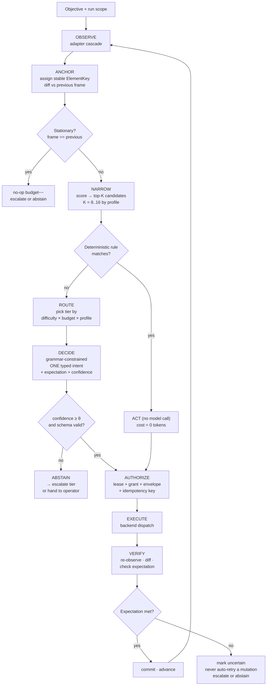
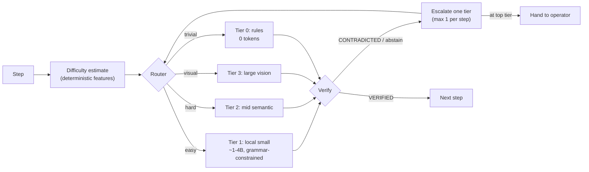
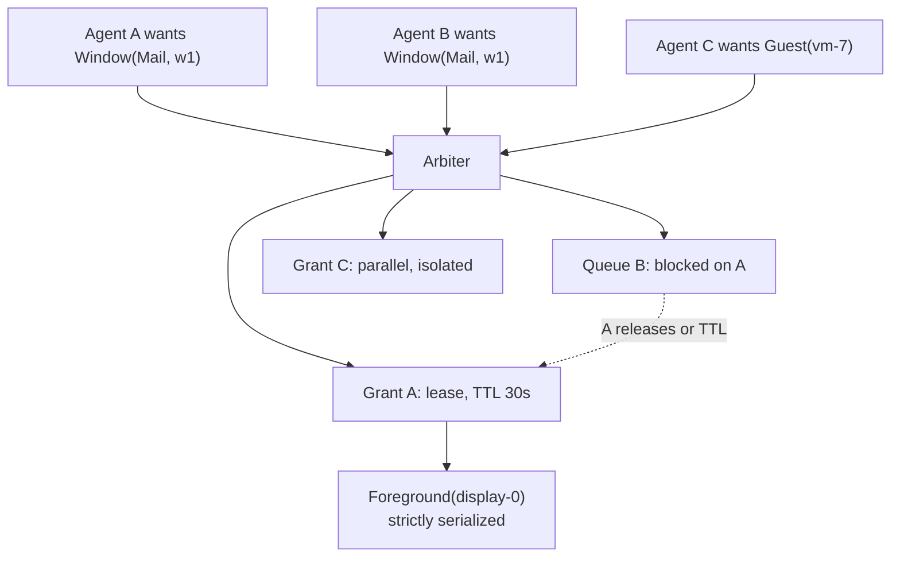

# Computer Use v2 — Target Architecture

**Status:** proposal from the authority lane. Nothing here is implemented in this branch.
**Baseline:** `codex/external-worker-hardening-v1` @ `8ad3be07`.
**Design rule:** every layer below must work with a 4B local model *and* a frontier vision model.
Efficiency is a property of the observation and verification layers, not a settings toggle.

---

## 0. The thesis

Existing Computer Use systems are demo-optimized: a screenshot goes to a large vision model, the model
emits pixel coordinates, the click either works or it does not, and the loop repeats. That design has
three structural costs — it is expensive per step, it cannot verify itself, and it fails silently.

GrokPtah already has the part that is hard to retrofit: a typed, fail-closed authority kernel. The
opportunity is to make **the perception and verification layers do the work the model is currently
being asked to do**. If the system can (a) name elements stably, (b) narrow 2,000 elements to ≤12
candidates, (c) state an expected postcondition before acting, and (d) check it after, then the model's
job collapses from "understand a screenshot" to "pick one of twelve and say why". That job fits in a
4B model. That is the whole architecture.

The corollary is the honest constraint: **the ceiling on reliability is set by the adapter, not the
model.** Where semantics are available (AX, DOM, app APIs) v2 should beat pixel-driven systems
decisively. Where they are not (canvas apps, remote desktops, games), v2 will fall back to the same
vision loop everyone else uses, and will be no better. The architecture must make that boundary
*visible and enforced* rather than hidden behind a retry.

---

## 1. Layer map

```
┌──────────────────────────────────────────────────────────────────────────────┐
│ L7  PRODUCT      Operator cockpit · profiles · approvals · a11y · help       │
├──────────────────────────────────────────────────────────────────────────────┤
│ L6  ORCHESTRATION  Durable runs · replay · cancel · recovery · arbitration    │
├──────────────────────────────────────────────────────────────────────────────┤
│ L5  AUTHORITY      Envelopes · leases · grants · idempotency · takeover fence │  ← exists (grants)
├──────────────────────────────────────────────────────────────────────────────┤
│ L4  DECISION       Router · budgets · abstention · escalation · verifier loop │  ← ABSENT
├──────────────────────────────────────────────────────────────────────────────┤
│ L3  INTENT         Typed action DSL · expectations · deterministic actions    │  ← partial
├──────────────────────────────────────────────────────────────────────────────┤
│ L2  IDENTITY       Stable element identity · anchors · staleness · stationarity│  ← ABSENT
├──────────────────────────────────────────────────────────────────────────────┤
│ L1  PERCEPTION     AX / DOM / app adapters → OCR → vision fallback            │  ← AX only
├──────────────────────────────────────────────────────────────────────────────┤
│ L0  SUBSTRATE      Host desktop · isolated guest VM · signed helper           │  ← branch-only
└──────────────────────────────────────────────────────────────────────────────┘
```

Layers L0, L1, L5, L6, L7 have real code today (some only on branches). **L2, L3-expectations, and L4
are the new work**, and they are what makes small models viable.

---

## 2. The step pipeline



Three properties of this pipeline are the whole design:

1. **The model sees ≤K candidates, never the tree.** Narrowing happens before routing, so cost is bounded
   by the profile, not by the application's complexity.
2. **Deterministic actions bypass the model entirely.** `activate_target`, `scroll to reveal`,
   `dismiss known dialog`, `wait for settle` are rules. In a good adapter these should be a large
   fraction of steps at zero token cost.
3. **The expectation is declared before the action and checked after it.** This is what converts
   "the click probably worked" into a measurable signal, and it is what makes abstention safe: a system
   that can tell when it failed can afford to stop.

---

## 3. L1 — Perception cascade

Adapters are tried in fidelity order and the run records which one produced the frame. A frame is
tagged with its provenance so downstream policy can refuse to act on low-fidelity perception.

```
   ┌────────────┐   semantic, addressable, cheap
1  │ APP ADAPTER│   app-specific API / scripting bridge / extension
   └─────┬──────┘   fidelity: EXACT
         │ miss
   ┌─────▼──────┐
2  │ DOM ADAPTER│   CDP / WebDriver for browser targets
   └─────┬──────┘   fidelity: EXACT
         │ miss
   ┌─────▼──────┐
3  │ AX ADAPTER │   macOS AX · Windows UIA · AT-SPI      ← only this exists today
   └─────┬──────┘   fidelity: SEMANTIC
         │ thin / missing tree
   ┌─────▼──────┐
4  │ OCR + LAYOUT│  local OCR, no model call, produces text boxes
   └─────┬──────┘   fidelity: DERIVED
         │ still ambiguous
   ┌─────▼──────┐
5  │ VISION      │  screenshot → large model, high-assurance profile only
   └─────────────┘  fidelity: INFERRED
```

**Fidelity gates authority.** A proposed policy, to be ratified in `CU-P1-01`:

| Fidelity | Semantic act | Text entry | Key chord | Pointer fallback |
|---|---|---|---|---|
| `EXACT` | allow | allow | allow | allow with grant |
| `SEMANTIC` | allow | allow | allow with grant | allow with grant |
| `DERIVED` (OCR) | **deny** | deny | deny | allow with grant + high-assurance profile |
| `INFERRED` (vision) | **deny** | deny | deny | allow with grant + high-assurance profile + operator confirm |

The point: OCR and vision may *locate*, they may not *name*. A pointer click derived from OCR is
honest about being a coordinate click and is priced accordingly. An `invoke` on an element that only
OCR believes exists is refused. This keeps the fallback from silently becoming the default.

---

## 4. L2 — Stable element identity (the keystone)

Today `element_id` is documented as *"Ephemeral reference scoped to one observation"*
(`types.rs:175`). Every observation renames the world. That forces a full re-read on each step, makes
diffing impossible, and makes stale-frame handling all-or-nothing.

### Proposed: `ElementKey`

A content-addressed, cross-observation identity computed by the adapter, never by the model:

```rust
/// Stable across observations of the same logical element.
/// Adapter-computed; the model never sees the components, only the key.
pub struct ElementKey(String);   // 128-bit, hex

// key = H( app_id, window_role_path, role, stable_traits )
//   window_role_path : ancestor role chain, index-free where the platform gives
//                      a durable identifier (AXIdentifier, DOM id, automation id)
//   stable_traits    : accessibility identifier > name > label > ordinal-within-role
```

Each element additionally carries an **anchor set**, ordered by durability, so re-anchoring can
degrade gracefully instead of failing:

| Anchor | Durability | Example |
|---|---|---|
| `platform_id` | highest | `AXIdentifier`, DOM `id`, UIA `AutomationId` |
| `role_path` | high | `window > toolbar > button[role=send]` |
| `label_hash` | medium | hash of visible label |
| `ordinal` | low | nth child of role within parent |
| `geometry` | lowest | bounds, only for tie-breaking, never alone |

### Re-anchoring outcomes

```
 previous frame element  ──►  current frame
   ├─ same ElementKey                        → MATCHED      (act freely)
   ├─ platform_id + role match, label moved  → RE-ANCHORED  (act, record drift)
   ├─ multiple candidates match              → AMBIGUOUS    (abstain or escalate)
   └─ no candidate                           → LOST         (fail closed; re-plan)
```

`AMBIGUOUS` and `LOST` are first-class outcomes that consume the no-op budget. They are **not** retried
silently — which is precisely the failure mode that makes existing tools look good in demos and
unreliable in use.

### Staleness becomes graded, not binary

The current model invalidates the whole observation after any successful action (`docs/COMPUTER_USE.md`
§Safety boundary, step 6), which is safe but forces a full re-read per step. With `ElementKey`, staleness
can be **scoped**:

| Class | Meaning | Disposition |
|---|---|---|
| `FRESH` | frame is current | act |
| `MUTATED_ELSEWHERE` | diff touched other subtrees only | act on unaffected keys; record |
| `MUTATED_TARGET` | the referenced key's subtree changed | reject; re-observe |
| `TARGET_DRIFT` | window generation changed | fail run, revoke authority (existing behavior) |

This is a strict tightening *and* a large efficiency win: it removes most full re-reads while making
the reject condition narrower and better justified. It must land behind the existing fail-closed
default and be proven by adversarial tests before the relaxation is enabled.

---

## 5. L3 — Typed intent DSL with expectations

The gate's `ComputerAction` (`types.rs:323-351`) is a good action vocabulary. What is missing is that
**an intent must state what it expects to become true**.

```rust
pub struct Intent {
    pub action: ComputerAction,        // existing, unchanged
    pub target: ElementKey,            // stable, not observation-scoped
    pub expectation: Expectation,      // NEW — declared before dispatch
    pub confidence: Confidence,        // NEW — 0..=1000, integer, model-supplied
    pub rationale: BoundedText,        // ≤256 bytes, audit only, never re-fed to a model
}

pub enum Expectation {
    /// The element's value equals this exactly after the action.
    ValueEquals { key: ElementKey, value: BoundedText },
    /// A key that did not exist now exists.
    ElementAppears { role: String, label_hash: Option<u64> },
    /// A key that existed no longer does.
    ElementDisappears { key: ElementKey },
    /// Enabled/checked/selected/focused state flips.
    StateChanges { key: ElementKey, trait_: ElementTrait, to: bool },
    /// Focus moves to this key.
    FocusMovesTo { key: ElementKey },
    /// Deliberate, must be justified; consumes assurance budget.
    NoObservableChange { because: NoOpReason },
}

pub enum Confidence { Low, Medium, High }   // wire: integer, coerced to bands
```

**Verification is then mechanical**, and requires no model:

```
act(intent) → re-observe → diff(before, after) → satisfies(expectation, diff)?
    ✓  → VERIFIED           advance, cost recorded
    ✗  → CONTRADICTED       do NOT retry a mutation; escalate or abstain
    ?  → UNVERIFIABLE       adapter could not observe the relevant subtree
                            → treat as uncertain (existing `uncertain_outcome`)
```

`CONTRADICTED` is the signal that today's architecture cannot produce. It is what allows the system to
say "I did something and it did not work" instead of continuing confidently into a wrong state.

### Deterministic (zero-model) actions

A rule table evaluated before routing. Each rule must be pure over the current frame:

| Rule | Precondition | Intent |
|---|---|---|
| `activate-if-inactive` | target window not frontmost | `ActivateTarget`, expect `FocusMovesTo` |
| `settle` | frame differs from 200 ms ago | `Wait{200}`, expect `NoObservableChange` |
| `dismiss-known-modal` | modal role + label in allowlist | `Invoke{dismiss}`, expect `ElementDisappears` |
| `scroll-to-reveal` | required key exists but is off-bounds | `Scroll`, expect `StateChanges{visible}` |
| `focus-before-type` | `SetValue` target not focused | `Invoke`, expect `FocusMovesTo` |

Every one of these is a step a vision-driven system spends a full model call on. Measuring the
deterministic-step fraction is a headline benchmark metric (§`BENCHMARK.md`).

---

## 6. L4 — Router, budgets, abstention, escalation



Difficulty features are computed, not guessed: candidate count after narrowing, best-vs-second score
margin, whether an exact label match exists, adapter fidelity, whether the last step was
`CONTRADICTED`, and remaining no-op budget.

**Budgets are per-run and enforced by the kernel**, extending the existing action/duration budget
(`service.rs:318`):

```rust
pub struct StepBudget {
    pub max_input_tokens: u32,
    pub max_output_tokens: u32,
    pub max_latency_ms: u32,
}
pub struct RunBudget {
    pub max_total_input_tokens: u64,
    pub max_total_output_tokens: u64,
    pub max_escalations: u32,
    pub max_noop_steps: u32,
    pub max_micro_usd: u64,      // integer micro-dollars; no floats in the ledger
}
```

Exhausting a budget is a **terminal, non-negotiable state** that reuses the existing `LimitReached`
transition. A model may never request a budget increase; only the operator may, and only by starting
a new run — the same rule that already governs `operator_takeover`.

---

## 7. L5 — Authority: envelopes and leases

The lease shape already exists as a DTO (`grokptah-agent-sdk/src/computer.rs:20`). v2 makes it the
enforcement primitive and wraps every dispatch in an envelope:

```rust
pub struct ActionEnvelope {
    pub envelope_id: Uuid,
    pub run_id: String,
    pub lease_id: LeaseId,             // must be live at dispatch
    pub expected_run_version: u64,     // optimistic concurrency (exists today)
    pub observation_id: String,        // exact frame (exists today)
    pub element_key: ElementKey,       // NEW: survives re-anchoring
    pub intent: Intent,
    pub idempotency_key: String,       // exists today as request_id
    pub not_valid_after: DateTime<Utc>,
    pub issued_by: GrantIssuer,        // exists today
    pub conflict_domain: ConflictDomain, // NEW: see §8
}
```

Lease invariants, all fail-closed and all testable without a model:

1. A lease binds `(run, target generation, action classes, conflict domain, TTL, uses)`.
2. A lease is never renewed in place — renewal issues a new lease id and a new epoch.
3. `operator_takeover` revokes every lease in the domain and is absorbing (existing behavior).
4. A lease does not survive restart, target change, or process identity change.
5. An envelope whose lease expired between authorization and dispatch fails as `Unauthorized`,
   never as a retryable error.

---

## 8. L6 — Multi-agent desktop arbitration

A desktop is a **single shared mutable resource with a global focus register**. Two agents acting on
one machine is not a scheduling problem, it is a mutual-exclusion problem.

```
ConflictDomain ::= Foreground(display)      // exactly one holder; focus is global
                 | Window(app_id, window_id)
                 | Guest(vm_id)             // isolated, parallel-safe
                 | Clipboard(session)       // exactly one holder
```



Rules:

- Any action requiring focus implicitly acquires `Foreground(display)`. That domain is **strictly
  serialized machine-wide**, so no two agents can race the focus register.
- `Guest(vm_id)` domains are parallel by construction. **This is the only honest path to real
  concurrency**, which makes the isolated-guest substrate a throughput feature, not just a safety one.
- A human taking over acquires every domain and is never queued behind an agent.
- Deadlock is prevented by ordering domain acquisition and by mandatory TTLs, not by detection.

`codex/computer-surface-leases-v1` already contains a `coordination.rs` (+614 lines) implementing part
of this. **Adopt that branch as the starting point rather than rewriting it** — see `LANE_PLAN.md`.

---

## 9. L0 — Two-tier execution

```
 TIER A  LOCAL SEMANTIC (host desktop)
   real apps · real credentials · AX/DOM adapters · Foreground domain
   strictly serialized · one-use operator approval per mutation
   blast radius: the user's actual machine  →  strictest policy

 TIER B  ISOLATED GUEST (VM)
   disposable · no host credentials · separate input surface · parallel-safe
   blast radius: the guest  →  pointer/vision fallback permitted here first
```

The threat model's constraint is correct and must be preserved verbatim: *"hidden windows, separate
Spaces, and global CGEvent injection do not qualify"* as isolation. Tier B requires a genuinely separate
input surface.

The architectural payoff of Tier B is underrated in the current docs: it is where **pointer and vision
fallback can be qualified safely**, and where **parallel agents become possible**. Tier B should be
built primarily as a capability enabler, not only as a containment measure.

**Blocking prerequisite:** two competing implementations exist
(`codex/cu-isolated-guest-bootstrap-v1` and `claude/computer-use-substrate-pr424-obejz2`).
Pick one before any further work — `CU-P0-01`.

---

## 10. Privacy, redaction, injection boundary

Existing and preserved:

- Secure elements may not carry values (`types.rs:188`).
- The projection is redaction-safe by construction (`projection.rs`).
- Observed content is labeled untrusted in the system prompt (`computer_agent.rs:245`).

Added in v2:

| Control | Placement |
|---|---|
| Redaction **before** the observation exists, not at the transport boundary | adapter |
| Secret detection (entropy + known formats) over OCR text before any model sees it | L1 |
| Per-run egress ledger: exactly what left the machine, to which route, how many bytes | L4 |
| Injection canary that is **sampled, rotated, and asserted-on** — replacing `computer_agent.rs:283` | L4 |
| Screenshot never leaves the host below the high-assurance profile | L4 policy |
| `rationale` text is audit-only and is never re-fed into a later prompt | L3 |

The last row matters more than it looks: re-feeding model-authored rationale is the standard way an
injection payload persists across steps. Making rationale write-only closes that loop by construction.

---

## 11. What this architecture does *not* claim

Stated plainly, because the alternative is a demo:

1. **It does not beat a large vision model at pixel-only targets.** Canvas apps, remote desktops, games,
   and custom-drawn UIs have no semantics to exploit. v2 falls back and is roughly at parity.
2. **It does not remove the need for a strong model on ambiguous intent.** Narrowing makes selection
   cheap; it does not make *planning* cheap. Multi-step planning stays on the mid or large tier.
3. **It does not make unattended operation safe.** Every mutation still requires authority. Removing the
   operator from the loop is a separate decision with a separate threat model.
4. **It does not deliver Windows or Linux for free.** Each adapter is real work with its own consent,
   attestation, and identity model.
5. **Small-model mode will abstain often, especially early.** That is the design working. An abstention
   is a success; a confident wrong click is the failure.
